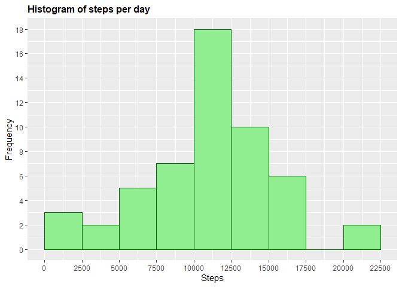
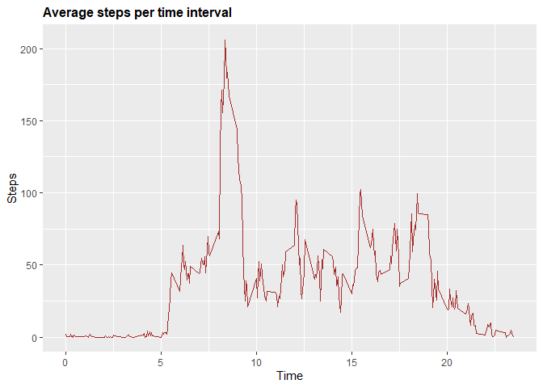
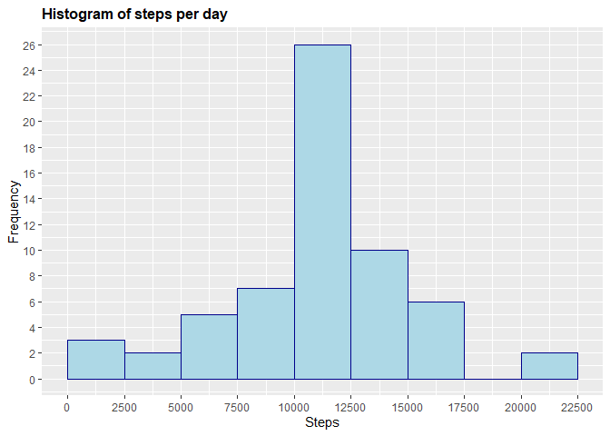
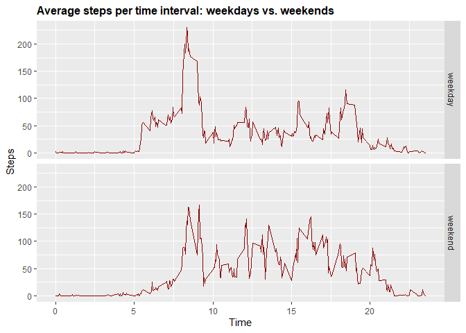

## Loading and preprocessing the data


```r
activity <- read.csv("activity.csv")
# libraries
library(ggplot2)
```

```
## Warning: package 'ggplot2' was built under R version 3.6.1
```

```r
library(dplyr)
```

```
## Warning: package 'dplyr' was built under R version 3.6.1
```

```
## 
## Attaching package: 'dplyr'
```

```
## The following objects are masked from 'package:stats':
## 
##     filter, lag
```

```
## The following objects are masked from 'package:base':
## 
##     intersect, setdiff, setequal, union
```
### Total no. of steps taken per day


```r
StepsPerDay <- aggregate(activity$steps, list(activity$date), FUN=sum)
colnames(StepsPerDay) <- c("Date", "Steps")
StepsPerDay
```

```
##          Date Steps
## 1  2012-10-01    NA
## 2  2012-10-02   126
## 3  2012-10-03 11352
## 4  2012-10-04 12116
## 5  2012-10-05 13294
## 6  2012-10-06 15420
## 7  2012-10-07 11015
## 8  2012-10-08    NA
## 9  2012-10-09 12811
## 10 2012-10-10  9900
## 11 2012-10-11 10304
## 12 2012-10-12 17382
## 13 2012-10-13 12426
## 14 2012-10-14 15098
## 15 2012-10-15 10139
## 16 2012-10-16 15084
## 17 2012-10-17 13452
## 18 2012-10-18 10056
## 19 2012-10-19 11829
## 20 2012-10-20 10395
## 21 2012-10-21  8821
## 22 2012-10-22 13460
## 23 2012-10-23  8918
## 24 2012-10-24  8355
## 25 2012-10-25  2492
## 26 2012-10-26  6778
## 27 2012-10-27 10119
## 28 2012-10-28 11458
## 29 2012-10-29  5018
## 30 2012-10-30  9819
## 31 2012-10-31 15414
## 32 2012-11-01    NA
## 33 2012-11-02 10600
## 34 2012-11-03 10571
## 35 2012-11-04    NA
## 36 2012-11-05 10439
## 37 2012-11-06  8334
## 38 2012-11-07 12883
## 39 2012-11-08  3219
## 40 2012-11-09    NA
## 41 2012-11-10    NA
## 42 2012-11-11 12608
## 43 2012-11-12 10765
## 44 2012-11-13  7336
## 45 2012-11-14    NA
## 46 2012-11-15    41
## 47 2012-11-16  5441
## 48 2012-11-17 14339
## 49 2012-11-18 15110
## 50 2012-11-19  8841
## 51 2012-11-20  4472
## 52 2012-11-21 12787
## 53 2012-11-22 20427
## 54 2012-11-23 21194
## 55 2012-11-24 14478
## 56 2012-11-25 11834
## 57 2012-11-26 11162
## 58 2012-11-27 13646
## 59 2012-11-28 10183
## 60 2012-11-29  7047
## 61 2012-11-30    NA
```

### Histogram for the steps taken per day

```r
g <- ggplot(StepsPerDay, aes(Steps))
g+geom_histogram(boundary=0, binwidth=2500, col="darkgreen", fill="lightgreen")+ggtitle("Histogram of steps per day")+xlab("Steps")+ylab("Frequency")+theme(plot.title = element_text(face="bold", size=12))+scale_x_continuous(breaks=seq(0,25000,2500))+scale_y_continuous(breaks=seq(0,18,2))
```

```
## Warning: Removed 8 rows containing non-finite values (stat_bin).
```

<!-- -->

### Mean of the total no. of steps taken per day


```r
mean(StepsPerDay$Steps, na.rm=TRUE)
```

```
## [1] 10766.19
```

### Median of the total no. of steps taken per day


```r
median(StepsPerDay$Steps, na.rm=TRUE)
```

```
## [1] 10765
```

# 2. Average daily activity pattern


```r
# create table with steps per time
StepsPerTime <- aggregate(steps~interval,data=activity,FUN=mean,na.action=na.omit)
# variable time (more comprensible for the graph axis)
StepsPerTime$time <- StepsPerTime$interval/100
# draw the line plot
h <- ggplot(StepsPerTime, aes(time, steps))
h+geom_line(col="brown")+ggtitle("Average steps per time interval")+xlab("Time")+ylab("Steps")+theme(plot.title = element_text(face="bold", size=12))
```

<!-- -->

## 5-min interval containing maximum no. of steps

```r
# table for dplyr
ST <- tbl_df(StepsPerTime)
# find the column
ST %>% select(time, steps) %>% filter(steps==max(ST$steps))
```

```
## # A tibble: 1 x 2
##    time steps
##   <dbl> <dbl>
## 1  8.35  206.
```

# 3. Imputing missing values
## Total no. of missing values in the dataset

```r
# table for dplyr
ACT <- tbl_df(activity)
# find the column
ACT %>% filter(is.na(steps)) %>% summarize(missing_values = n())
```

```
## # A tibble: 1 x 1
##   missing_values
##            <int>
## 1           2304
```

## Filling in all the missing values in the dataset


```r
# values without NA are imputed in a new column
activity$CompleteSteps <- ifelse(is.na(activity$steps), round(StepsPerTime$steps[match(activity$interval, StepsPerTime$interval)],0), activity$steps)
```

## New dataset with the missing data filled in


```r
# new dataset activityFull
activityFull <- data.frame(steps=activity$CompleteSteps, interval=activity$interval, date=activity$date)
# see first 10 values of the new dataset
head(activityFull, n=10)
```

```
##    steps interval       date
## 1      2        0 2012-10-01
## 2      0        5 2012-10-01
## 3      0       10 2012-10-01
## 4      0       15 2012-10-01
## 5      0       20 2012-10-01
## 6      2       25 2012-10-01
## 7      1       30 2012-10-01
## 8      1       35 2012-10-01
## 9      0       40 2012-10-01
## 10     1       45 2012-10-01
```

## Histogram for total no. of steps taken for each day 


```r
# prepare data
StepsPerDayFull <- aggregate(activityFull$steps, list(activityFull$date), FUN=sum)
colnames(StepsPerDayFull) <- c("Date", "Steps")
# draw the histogram
g <- ggplot(StepsPerDayFull, aes(Steps))
g+geom_histogram(boundary=0, binwidth=2500, col="darkblue", fill="lightblue")+ggtitle("Histogram of steps per day")+xlab("Steps")+ylab("Frequency")+theme(plot.title = element_text(face="bold", size=12))+scale_x_continuous(breaks=seq(0,25000,2500))+scale_y_continuous(breaks=seq(0,26,2))
```

<!-- -->

## Mean of total no. of steps taken per day


```r
mean(StepsPerDayFull$Steps)
```

```
## [1] 10765.64
```

## Median of total no. of steps taken per day


```r
median(StepsPerDayFull$Steps)
```

```
## [1] 10762
```

# 4. Differences in activity patterns between weekdays and weekends


```r
# Create variable with date in correct format
activityFull$RealDate <- as.Date(activityFull$date, format = "%Y-%m-%d")
# create a variable with weekdays name
activityFull$weekday <- weekdays(activityFull$RealDate)
# create a new variable indicating weekday or weekend
activityFull$DayType <- ifelse(activityFull$weekday=='Saturday' | activityFull$weekday=='Sunday', 'weekend','weekday')
# see first 10 values
head(activityFull, n=10)
```

```
##    steps interval       date   RealDate weekday DayType
## 1      2        0 2012-10-01 2012-10-01  Monday weekday
## 2      0        5 2012-10-01 2012-10-01  Monday weekday
## 3      0       10 2012-10-01 2012-10-01  Monday weekday
## 4      0       15 2012-10-01 2012-10-01  Monday weekday
## 5      0       20 2012-10-01 2012-10-01  Monday weekday
## 6      2       25 2012-10-01 2012-10-01  Monday weekday
## 7      1       30 2012-10-01 2012-10-01  Monday weekday
## 8      1       35 2012-10-01 2012-10-01  Monday weekday
## 9      0       40 2012-10-01 2012-10-01  Monday weekday
## 10     1       45 2012-10-01 2012-10-01  Monday weekday
```

## Making a plot for the above


```r
# create table with steps per time across weekdaydays or weekend days
StepsPerTimeDT <- aggregate(steps~interval+DayType,data=activityFull,FUN=mean,na.action=na.omit)
# variable time (more comprensible for the graph axis)
StepsPerTimeDT$time <- StepsPerTime$interval/100
# draw the line plot
j <- ggplot(StepsPerTimeDT, aes(time, steps))
j+geom_line(col="darkred")+ggtitle("Average steps per time interval: weekdays vs. weekends")+xlab("Time")+ylab("Steps")+theme(plot.title = element_text(face="bold", size=12))+facet_grid(DayType ~ .)
```

<!-- -->
